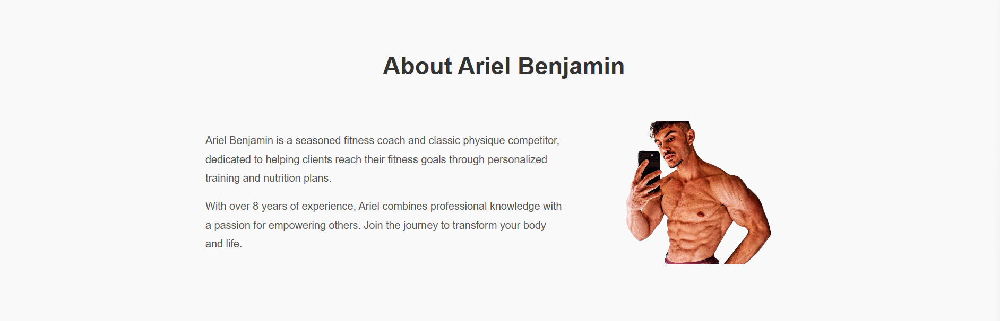

# Ariel Benjamin Fitness - Demo Website

This repository hosts a demo website for **Ariel Benjamin Fitness**, a professional fitness coaching service that offers personalized workout plans, nutrition plans, and round-the-clock support. The purpose of this website is to showcase the structure, design, and functionality of a fitness coaching platform.

## Table of Contents

- [Live Demo](#live-demo)
- [Features](#features)
- [Screenshots](#screenshots)
- [Technologies Used](#technologies-used)
- [Setup](#setup)
- [Usage](#usage)
- [Contributing](#contributing)
- [License](#license)

## Live Demo

[Visit the Live Demo](https://your-demo-link.com)

## Features

- **Hero Section**: Catchy headline with a call-to-action button to encourage user engagement.
- **About Section**: Overview of Ariel Benjamin's experience and mission in fitness coaching.
- **Program Section**: List of available programs, including Personal Attention, Workout Plan, and Nutrition Plan.
- **Testimonials Section**: Customer testimonials to build credibility.
- **Contact Form**: This simple form allows potential clients to reach out.
- **Responsive Design**: Optimized for all screen sizes.

## Screenshots

### Header and Hero Section


### About Section


### Programs Section


### Testimonials Section


### Contact Section


## Technologies Used

- **HTML5** - Structure of the website.
- **CSS3** - Styling for layout, fonts, and responsiveness.
- **JavaScript (optional)** - For any interactivity or animations.
- **Font Awesome** - Social media icons in the footer.
- **Google Fonts** - Custom fonts for an enhanced look.

## Setup

To set up this project locally:

1. **Clone the repository**:
   ```bash
   git clone https://github.com/Fumez-DEV/ariel-benjamin-fitness.git```

2. **Navigate into the directory:**
```cd ariel-benjamin-fitness```

3. **Open** ``index.html`` **in your browser to view the site.**

## Usage

• Open the site and navigate through each section: **Home, About, Programs, Testimonials, and Contact.**
• Test the responsiveness by resizing the browser window or viewing it on different devices.
• Interact with the Contact Form (no backend implemented for demo).

## Contributing
Contributions are welcome! If you’d like to contribute, please fork the repository and create a pull request.

1. Fork the repository.
2. Create a new branch with a descriptive name.
3. Make changes and commit them.
4. Push to your fork and create a pull request.

## License
This project is licensed under the MIT License - see the LICENSE file for details.

Note: This is a demo website created to showcase design and layout. It is not connected to a real backend or API for functionality.

This `README.md` provides a comprehensive overview of the project, including setup instructions, usage, and information about each section of the site. Remember to replace placeholder URLs and file paths with actual links after you've set them up.
